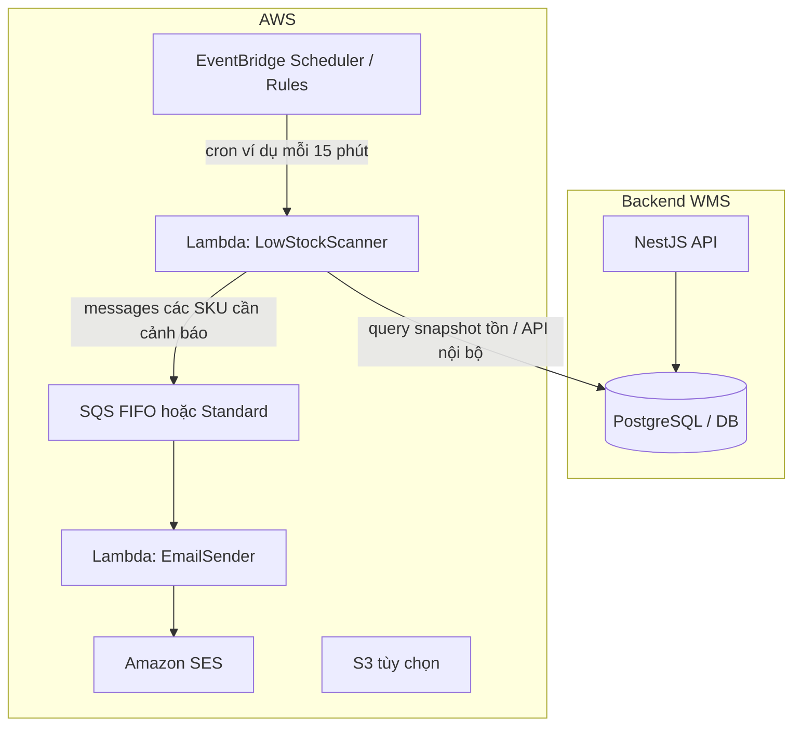

# Tích hợp AWS — Cảnh báo tồn thấp, email & tác vụ nền (phác thảo)

## Tài liệu tham chiếu

- [WMS MVP — tổng quan](../wms-mvp-overview.md)
- [Tồn kho — basic design](../inventory/basic-design.md)
- [Báo cáo — basic design](../reports/basic-design.md)
- [Setup AWS trên máy (Windows) — IAM & CLI](./aws-setup-may-tinh-iam-cli.md)

## Mục đích

Mô tả **phương án triển khai** các chức năng phi đồng bộ trên AWS, ưu tiên:

1. **Cảnh báo tồn kho thấp** (theo ngưỡng có cấu hình).
2. **Thông báo qua email** (cảnh báo + có thể mở rộng báo cáo / nhắc kiểm kê).
3. **Một số chức năng nền khác** cùng kiến trúc (queue + Lambda + lịch).

Nguyên tắc: **tồn và chứng từ** vẫn do backend WMS (NestJS + DB) làm nguồn sự thật; AWS chỉ đọc dữ liệu đã commit, gửi thông báo, hoặc xử lý tác vụ dài.

---

## 1. Kiến trúc tổng quan (đề xuất)

**Biến thể đơn giản (MVP+):** bỏ SQS — Scheduler gọi một Lambda duy nhất: quét DB → gửi email batch trong cùng function (chấp nhận giới hạn thời gian chạy Lambda; phù hợp số SKU / kho vừa phải).

**Biến thể mở rộng:** tách **Scanner** và **Notifier** bằng SQS để retry, DLQ, và giảm trùng lặp khi volume lớn.

---

## 2. Cảnh báo tồn kho thấp

### 2.1. Dữ liệu cấu hình (trong WMS, không chỉ hard-code Lambda)

| Khái niệm | Gợi ý |
|-----------|--------|
| **Phạm vi ngưỡng** | Theo `variant_id` + `warehouse_id` (optional: `location_id` nếu cần cảnh báo theo ô). |
| **Ngưỡng** | `min_quantity` (hoặc `reorder_point`) — khi `tổng tồn khả dụng ≤ ngưỡng` → đủ điều kiện cảnh báo. |
| **Tắt / bật** | `alert_enabled` per rule hoặc per variant-warehouse. |

Có thể bổ sung bảng `stock_alert_rules` (hoặc mở rộng master sản phẩm) — chi tiết schema để viết trong `detail-design` khi chốt phạm vi.

### 2.2. Cách lấy “tồn hiện tại”

- Đồng bộ [inventory basic](../inventory/basic-design.md): aggregate `stock_balances.quantity` theo `(variant_id, warehouse_id)` (và tùy policy: chỉ vị trí lá).
- Lambda **ưu tiên** gọi **API nội bộ có auth** (API key / IAM + VPC) hoặc đọc **read-replica** DB nếu team chấp nhận vận hành DB từ Lambda — tránh duplicate business logic.

### 2.3. Tránh spam email (dedup / cooldown)

| Cơ chế | Mô tả ngắn |
|--------|------------|
| **Cooldown** | Cùng `(variant, warehouse)` chỉ gửi lại sau `X` giờ (lưu `last_alert_at` trong DB hoặc DynamoDB / ElastiCache). |
| **Trạng thái** | Chỉ gửi khi chuyển từ “trên ngưỡng” → “dưới ngưỡng” (edge detection) cần snapshot trước đó hoặc cờ trong store. |
| **SQS FIFO + MessageGroupId** | Nhóm theo SKU-kho để serialize xử lý (tùy chọn). |

---

## 3. Thông báo qua email (Amazon SES)

### 3.1. Luồng

1. Lambda (hoặc bước cuối pipeline) dựng **nội dung** (HTML/text): danh sách SKU, tên SP, kho, tồn hiện tại, ngưỡng, link deeplink về màn hàng tồn trong WMS.
2. Gửi qua **SES** `SendEmail` / `SendRawEmail` (template trong SES hoặc template trong code).
3. **Xác minh miền** (domain / email) và thoát sandbox SES trước khi production.

### 3.2. Danh sách người nhận

- Gợi ý: cấu hình theo **kho** hoặc theo **vai trò** (Manager kho) — map trong bảng `notification_subscribers` hoặc reuse user email từ module [user](../user/basic-design.md) nếu đã có.

### 3.3. Thay SES bằng SNS (email subscription)

- Phù hợp khi chỉ cần **fan-out đơn giản**; nội dung HTML phức tạp hơn thì SES trực tiếp thường gọn hơn.

---

## 4. Lên lịch (EventBridge Scheduler / Rules)

| Tác vụ | Gợi ý tần suất |
|--------|----------------|
| Quét tồn thấp | Mỗi 5–30 phút (tùy SLA vận hành). |
| Báo cáo định kỳ (xem mục 5) | 1 lần/ngày (giờ ít tải). |
| Dọn log / tái chế job cũ | 1 lần/tuần |

Scheduler gọi Lambda trực tiếp hoặc đẩy message vào SQS để tách rate limit.

---

## 5. Chức năng nền khác (cùng “họ” kiến trúc)

| Chức năng | AWS | Ghi chú ngắn |
|-----------|-----|--------------|
| **Export báo cáo CSV lớn** | SQS + Lambda + S3 | API tạo job → worker tạo file → link download có TTL; khớp hướng MVP+ trong [reports](../reports/basic-design.md). |
| **Nhắc kiểm kê định kỳ** | Scheduler + Lambda + email | Tạo nhắc hoặc tạo “kỳ kiểm kê” draft theo kho. |
| **Đồng bộ sang hệ thống ngoài** | SQS + Lambda | Sau khi chứng từ completed, WMS publish event → consumer đẩy ERP/webhook. |
| **Import master data từ file** | S3 event → Lambda → SQS | Validate từng batch, tránh timeout API. |

---

## 6. Bảo mật & vận hành

- Lambda trong **VPC** nếu chỉ DB private; hoặc chỉ gọi **HTTPS API nội bộ** có mạng phù hợp.
- IAM least privilege: Lambda chỉ `ses:SendEmail`, `sqs:*` trên queue cụ thể, `s3:PutObject` prefix cụ thể.
- **Secrets**: URL DB / API key trong **Secrets Manager** hoặc **SSM Parameter Store**.
- **Quan sát**: CloudWatch Logs, alarm trên DLQ depth, `Errors` metric Lambda.

---

## 7. Phạm vi triển khai theo giai đoạn (đề xuất)

| Giai đoạn | Nội dung |
|-----------|----------|
| **1** | Bảng ngưỡng + API quản lý tối thiểu trong WMS; SES gửi email thủ công / endpoint test. |
| **2** | EventBridge + Lambda quét định kỳ + cooldown + email SES. |
| **3** | Thêm SQS + DLQ; mở rộng export báo cáo S3. |

---

## 8. Việc còn lại khi chuyển sang detail-design

- Schema bảng rule / lịch sử gửi (`stock_alert_events`).
- Contract API nội bộ cho Lambda (`GET /internal/inventory/below-threshold` hoặc tương đương).
- Chính sách i18n nội dung email (vi/en).

Tài liệu này là **phác thảo kiến trúc**; chưa ràng buộc triển khai IaC (CDK/Terraform) hay ngôn ngữ Lambda (Node/Python).
