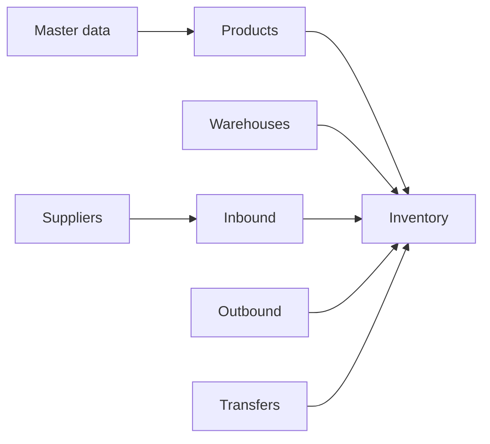

# WMS MVP — Tổng quan

## Mục tiêu

Hệ thống quản lý kho (Warehouse Management System) phiên bản MVP: quản **sản phẩm & biến thể**, **kho & vị trí**, **nhà cung cấp**, **nhập / xuất / chuyển kho**, **tồn kho**, **phân quyền cơ bản**, **báo cáo tối thiểu**, **master data** hỗ trợ vận hành.

## Phạm vi ngoài MVP (ghi nhận, chưa triển khai)

- Tích hợp kế toán / ERP đầy đủ, barcode hardware, picking tối ưu đường đi.
- Đa tenant, đa công ty phức tạp (có thể chỉ cần `organization_id` sau này).

## Bản đồ module

| Module | Thư mục spec | Mô tả ngắn |
|--------|----------------|------------|
| Master data | [master-data](./master-data/basic-design.md) | Mục lục: [categories](./master-data/categories/basic-design.md), [units](./master-data/units/basic-design.md), [attributes](./master-data/attributes/basic-design.md), [attribute-values](./master-data/attribute-values/basic-design.md) |
| Sản phẩm | [products](./products/basic-design.md) | Sản phẩm, biến thể, SKU |
| Kho & vị trí | [warehouses](./warehouses/basic-design.md) | Kho, kệ/ô, cấu trúc vị trí |
| Nhà cung cấp | [suppliers](./suppliers/basic-design.md) | NCC, liên hệ, liên kết nhập |
| Nhập kho | [inbound](./inbound/basic-design.md) | Phiếu nhập, cộng tồn |
| Xuất kho | [outbound](./outbound/basic-design.md) | Phiếu xuất, trừ tồn |
| Chuyển kho | [transfers](./transfers/basic-design.md) | Chuyển giữa kho / vị trí |
| Tồn kho | [inventory](./inventory/basic-design.md) | Tồn theo SP / kho / vị trí |
| Phân quyền | [auth](./auth/basic-design.md) | Vai trò: Admin, NV kho, Manager |
| Báo cáo | [reports](./reports/basic-design.md) | Tồn, lịch sử, top SP |

## Luồng dữ liệu cốt lõi

## Nguyên tắc chung

- **Một nguồn sự thật cho tồn**: cập nhật tồn chỉ qua giao dịch có chứng từ (nhập / xuất / chuyển), có trạng thái (draft → approved/completed).
- **SKU gắn biến thể**: mỗi dòng tồn / mỗi dòng phiếu tham chiếu `variant_id` (hoặc `sku` duy nhất).
- **Phân quyền**: thao tác nhạy cảm (duyệt, xóa, cấu hình) tách khỏi thao tác vận hành hàng ngày.

## Tài liệu chi tiết

Từng module có `basic-design.md` (thiết kế cơ bản). Khi triển khai API/DB, bổ sung `detail-design.md` theo module (theo mẫu `moduleA` / `moduleB`).
